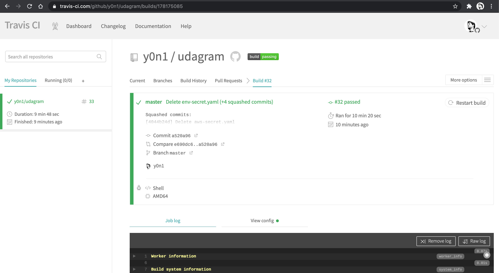
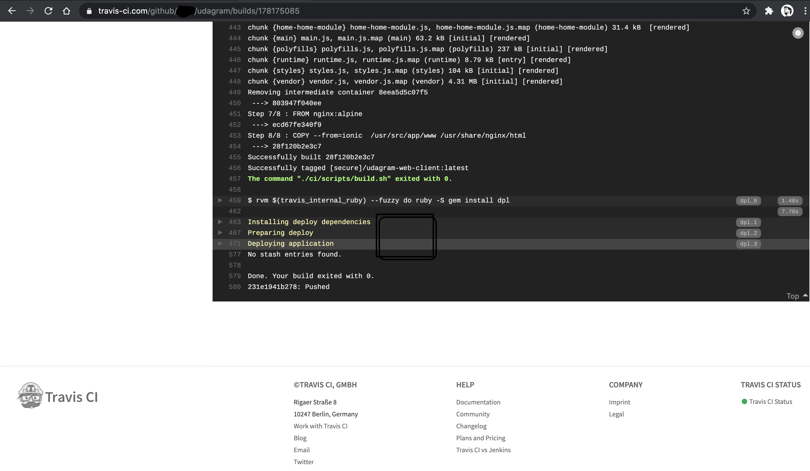
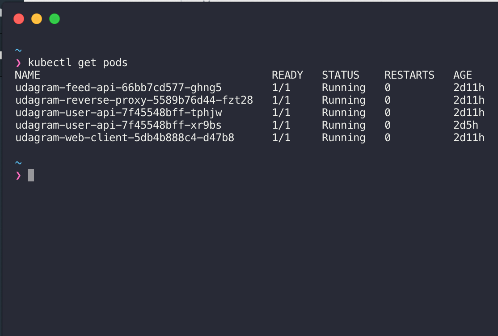
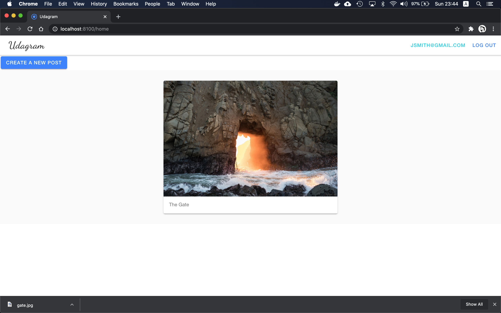
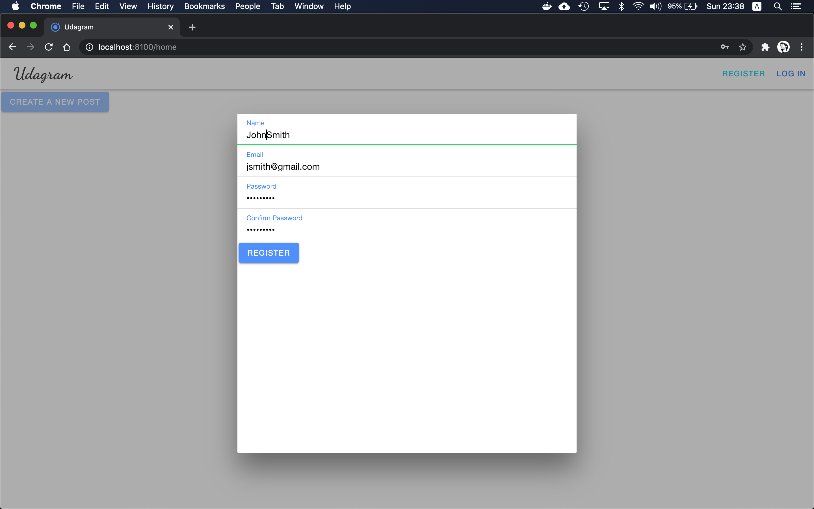

# Udagram
## An Instagram clone

In this project, I applied the new skills I have aquired in order to design, deploy and operate a cloud native photo sharing application. The challenge behind this project was to demonstrate how the starter monolith code-base for the application could be extended into a microservice architecture.

### Screenshot of TravisCI which shows the successful build and deploy steps

### The public GitHub repo and the docker hub images
1. The GitHub repo is located here: 
    - [https://github.com/y0n1/udagram](https://github.com/y0n1/udagram) 

2. The Docker Hub images can be found here: 
    - [https://hub.docker.com/repository/docker/y0n1/udagram-feed-api](https://hub.docker.com/repository/docker/y0n1/udagram-feed-api)
    - [https://hub.docker.com/repository/docker/y0n1/udagram-user-api](https://hub.docker.com/repository/docker/y0n1/udagram-user-api)
    - [https://hub.docker.com/repository/docker/y0n1/udagram-web-client](https://hub.docker.com/repository/docker/y0n1/udagram-web-client)
    - [https://hub.docker.com/repository/docker/y0n1/udagram-reverse-proxy](https://hub.docker.com/repository/docker/y0n1/udagram-reverse-proxy)

### Screenshot of kubectl get pod which shows all running containers

### Screenshots of the application

